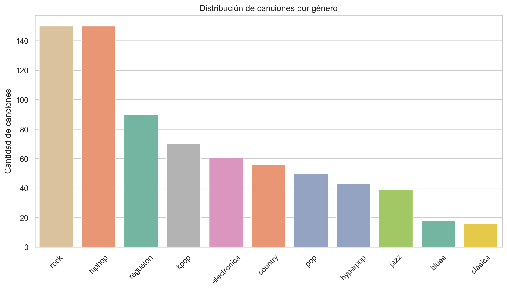
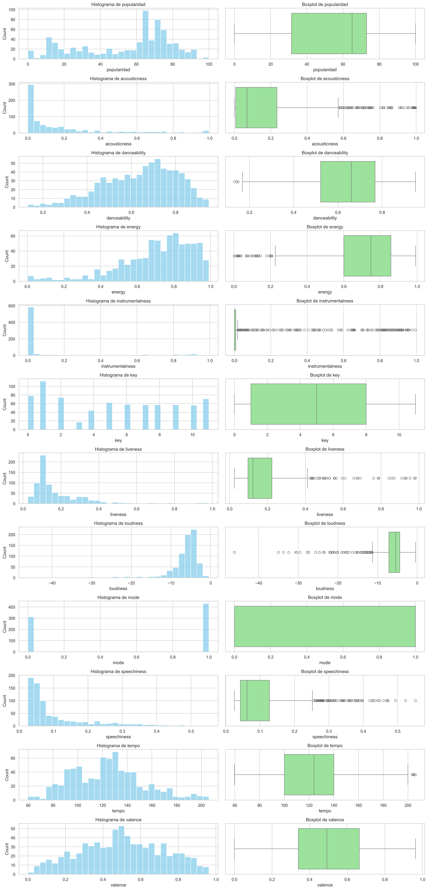
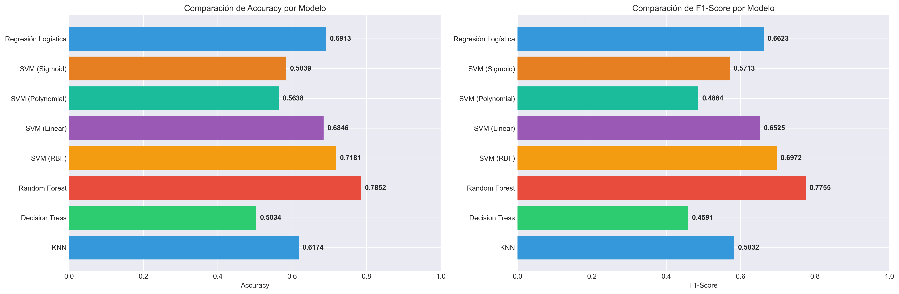
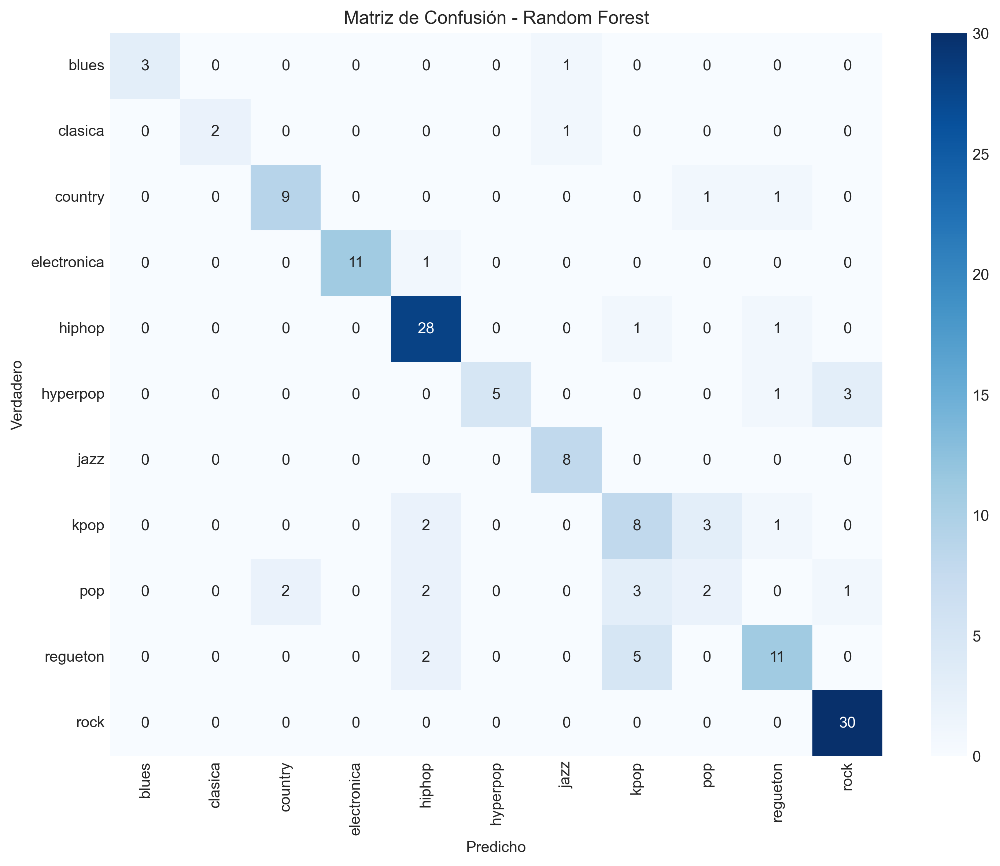

# Entrega (Informe) — Análisis exploratorio, modelado y conclusiones

## Resumen ejecutivo

Se construyó un dataset propio (≈ 743 registros) con características acústicas y metadatos de canciones recopiladas desde playlists en Spotify y YouTube Music y complementadas con Reccobeats. El objetivo fue entrenar modelos de aprendizaje supervisado para clasificar el **género** de cada canción (11 clases). Tras el preprocesamiento y la partición estratificada, se entrenaron múltiples algoritmos. El mejor desempeño lo obtuvo **Random Forest** (accuracy = **0.7852**, F1-score = **0.7755**). El informe documenta el origen de los datos, el análisis exploratorio (EDA) cuantitativo, la descripción del modelado y las conclusiones derivadas.

---

## 1. Origen y proceso de obtención de los datos

* **Fuentes:** playlists públicas de **Spotify** y **YouTube Music**; características acústicas completadas con **Reccobeats**.
* **Motivación:** actualizar el dataset original de Kaggle (“Spotify Data Visualization”) a material más reciente. La API de Spotify no ofrecía acceso directo a todas las variables necesarias, por lo que se construyó un dataset propio.
* **Fecha de adquisición:** recopilación en el período reciente (Octubre–Noviembre 2025; el dataset contiene temas hasta 2025).
* **Tamaño:** 743 registros (filas) tras limpieza y filtrado.
* **Clases:** 11 géneros (rock, hiphop, reguetón, kpop, electronica, country, pop, hyperpop, jazz, blues, clásica).
* **Notas sobre calidad:** Reccobeats no cubre todas las canciones; por eso se excluyeron registros sin características acústicas completas. Se eliminaron duplicados y se estandarizaron columnas y nombres.

---

## 2. Descripción del dataset (resumen cuantitativo)

* **Instancias totales:** 743.
* **Columnas principales (ejemplos):** `artista`, `tema`, `genero` (objetivo), `popularidad`, `año`, `acousticness`, `danceability`, `energy`, `instrumentalness`, `liveness`, `loudness`, `mode`, `speechiness`, `tempo`, `valence`, `spotify_id`, `href`.
* **Tipos de dato:** `string` (artista, tema, genero, fuente, href), `integer` (año, popularidad, key, mode), `float` (características acústicas).
* **Estadísticas resumidas (valores clave, extraídos de `df.describe().T`):**

  * `popularidad`: count=743, mean ≈ **54.15**, std ≈ 25.29, median = 65.
  * `año`: mean ≈ 1681.25 (observación: valores bajos/0 presentes; ver nota de calidad), median 2024–2025 (la mayoría es reciente).
  * `acousticness`: mean ≈ 0.178, distribución fuertemente sesgada hacia 0.
  * `danceability`: mean ≈ 0.638 (median 0.661).
  * `energy`: mean ≈ 0.706 (median 0.748).
  * `instrumentalness`: mean ≈ 0.112, pero **gran mayoría de ceros**.
  * `loudness`: mean ≈ -6.54 dB, con concentración entre -10 y -5 dB.
  * `tempo`: mean ≈ 124 BPM, con gran concentración en 100–133 BPM.
  * `valence`: mean ≈ 0.500 (canciones distribuidas en torno a lo neutral).

> Observación técnica: el campo `año` muestra valores anómalos (mean 1681) que indican casos con `0` o valores mal formateados; conviene revisar e imputar/corregir esos registros antes de ciertos análisis temporales.

---

## 3. Distribución por género (clases)

Frecuencia absoluta (y % aproximado sobre n=743):

* `rock` — 150 (20.19%)
* `hiphop` — 150 (20.19%)
* `regueton` — 90 (12.11%)
* `kpop` — 70 (9.42%)
* `electronica` — 61 (8.21%)
* `country` — 56 (7.54%)
* `pop` — 50 (6.73%)
* `hyperpop` — 43 (5.79%)
* `jazz` — 39 (5.25%)
* `blues` — 18 (2.42%)
* `clasica` — 16 (2.15%)


**Implicación:** existe **desequilibrio de clases** (dos géneros dominantes ~20% c/u). Se aplicó particionado estratificado en train/test para preservar las proporciones (`train_test_split(..., stratify=y_encoded, test_size=0.2, random_state=42)`), lo que ayuda a evaluar modelos sin introducir sesgo por partición.



---

## 4. Análisis exploratorio de datos (EDA): histogramas y boxplots — interpretación narrativa

A continuación se presentan hallazgos clave derivados de las tablas de histogramas y las estadísticas tipo boxplot que facilitaste.

### 4.1 Popularidad

* **Distribución (histograma):** hay un número importante de canciones en las bandas 60–70 y 70–80 (170 observaciones en cada una), acumulando una gran porción del dataset en valores altos de popularidad.
* **Estadísticos:** Q1 = 31.5, mediana = 65, Q3 = 73, IQR = 41.5. Min = 0, Max = 100.
* **Interpretación:** la distribución no es uniforme; hay una concentración hacia la mitad-alta (valores ≥ 60). Existen canciones muy poco populares (0) y otras muy populares (100); la mediana alta sugiere que la muestra seleccionada contiene muchas canciones con cierto grado de exposición.

### 4.2 Acousticness (acústica)

* **Histograma:** ~419/743 canciones (≈56%) tienen acousticness en [0, 0.1] (valores muy bajos).
* **Boxplot:** Q1 = 0.00688, mediana = 0.0693, Q3 = 0.234; IQR ≈ 0.227. Hay **75 outliers** según criterio IQR.
* **Interpretación:** la mayoría de las canciones muestran baja proporción de componentes acústicos (son más electrónicas o con producción). La cola superior indica un subconjunto claramente más acústico (folk, folk-rock, blues, clásica).

### 4.3 Danceability (bailabilidad)

* **Histograma:** concentra en valores medios-altos (picos en bins que rondan 0.54–0.87).
* **Boxplot:** Q1 = 0.522, mediana = 0.661, Q3 = 0.768, IQR = 0.246; solo 3 outliers.
* **Interpretación:** el dataset contiene predominantemente canciones con alta aptitud para baile; puede deberse a la selección de playlists comerciales/populares.

### 4.4 Energy (energía)

* **Histograma:** alto conteo en rangos superiores (bins ≈ 0.596–0.991 acumulando la mayoría).
* **Boxplot:** mediana = 0.748, Q3 = 0.857, IQR ≈ 0.257; 27 outliers.
* **Interpretación:** predomina música con alto contenido energético (pop, rock, hiphop, reguetón, electrónica), menos material muy tranquilo.

### 4.5 Instrumentalness (instrumentalidad)

* **Histograma:** 608 registros en [0,0.1] (prácticamente cero vocales o baja probabilidad de instrumentalidad), y la mayoría muy cercana a 0.
* **Boxplot:** Q1 = 0, mediana ≈ 0, Q3 = 0.00747, IQR pequeño; **169 outliers** (pistas claramente instrumentales).
* **Interpretación:** la mayoría de las pistas contienen voz; sin embargo existe un grupo notable de pistas instrumentales (e.g., música clásica, temas instrumentales, remixes).

### 4.6 Liveness (presencia en vivo)

* **Histograma:** mayor concentración en los bins más bajos (0.025–0.121 y 0.121–0.217), indicando grabaciones de estudio.
* **Boxplot:** mediana = 0.123, Q3 = 0.2235, IQR ≈ 0.127; 40 outliers.
* **Interpretación:** la mayoría de las pistas son grabaciones de estudio; solo unas pocas registran audiencias en vivo pronunciadas.

### 4.7 Loudness (volumen)

* **Histograma:** gran concentración en los bins [-9.567, -4.998] y [-4.998, -0.43] (358 y 300 observaciones respectivamente).
* **Boxplot:** mediana ≈ -5.408 dB, Q1 ≈ -7.1555 dB, Q3 ≈ -4.394 dB; 49 outliers (muy bajos o muy altos).
* **Interpretación:** la mayoría de las canciones está mezclada/normalizada en un rango habitual de loudness moderno (aprox. -10 a -0 dB). Outliers con loudness extrema pueden corresponder a grabaciones antiguas o tracks muy suaves.

### 4.8 Speechiness (presencia de habla)

* **Histograma:** gran masa en [0.025–0.078] (460 observaciones), indicando que la mayoría son pistas musicales (no habladas).
* **Boxplot:** mediana = 0.0616, Q3 = 0.127; 78 outliers.
* **Interpretación:** la mayoría no es contenido hablado, pero hay casos con mayor speechiness (posibles cortes de rap, interludios hablados o podcasts incluidos por error).

### 4.9 Tempo

* **Histograma:** alta concentración en 88.9–132.9 BPM (particularmente 118–133 BPM con 189 observaciones).
* **Boxplot:** mediana ≈ 124 BPM, Q1 ≈ 100 BPM, Q3 ≈ 140 BPM; pocos outliers.
* **Interpretación:** tempo centrado en ritmos típicos de música popular (pop/hiphop/reguetón/electronica).

### 4.10 Valence (valencia emocional)

* **Histograma:** distribución bastante balanceada en torno a 0.5; pico moderado en bins 0.482–0.578.
* **Boxplot:** mediana ≈ 0.492, IQR ≈ 0.324; sin outliers extremos.
* **Interpretación:** mezcla de canciones “tristes” y “alegres”, sin sesgo extremo.




---

## 5. Conclusiones derivadas del EDA

1. **Dataset orientado a música contemporánea y popular:** la mediana del año y la concentración en popularidad y tempos comunes indican selección de playlists comerciales.
2. **Predominancia de señales no acústicas:** `acousticness` está mayoritariamente en valores bajos; `energy` y `danceability` altos señalan una muestra con fuerte sesgo hacia géneros producidos electrónicamente o altamente editados.
3. **Instrumentalidad mayoritariamente nula:** la mayoría de las pistas incluye voz; sin embargo, existe un subgrupo claro de pistas instrumentales que conviene detectar (pueden afectar clasificación por género).
4. **Desequilibrio de clases:** aunque no extremo, hay diferencias importantes entre clases (rock/hiphop dominantes). Esto requiere cuidado en evaluación y posibles estrategias de balanceo si se busca optimizar performance por clases minoritarias.
5. **Calidad de algunos campos:** el campo `año` contiene valores anómalos (0 u otros) que deberían limpiarse/imputarse si se va a usar para análisis temporales.
6. **Outliers presentes en varias variables (instrumentalness, acousticness, speechiness, loudness):** conviene tratarlos o al menos comprender su origen (grabaciones antiguas, pistas instrumentales, etc.) antes de normalizar o escalar.

---

## 6. Modelado: algoritmos y configuración general

### 6.1 Partición y preprocesamiento usados

* **Partición:** `train_test_split(X, y_encoded, test_size=0.2, random_state=42, stratify=y_encoded)` → split estratificado 80/20.
* **Transformaciones previas:** (según tu flujo habitual) conversión de tipos, eliminación de duplicados, manejo de faltantes (se excluyeron registros sin características acústicas completas). En caso de escalado/normalización, se recomienda `StandardScaler` para algoritmos sensibles a escala (SVM, KNN, regresión logística).
* **Encoding:** `y` codificado a `y_encoded` (label encoding) para clasificación.

### 6.2 Modelos entrenados y resultados comparativos

Se entrenaron y compararon los siguientes modelos (resumen provisto):

| Modelo              |    Accuracy |    F1-Score |
| ------------------- | ----------: | ----------: |
| KNN                 |     0.61745 |     0.58319 |
| Decision Tree       |     0.58389 |     0.59228 |
| Random Forest       | **0.78524** | **0.77546** |
| SVM (RBF)           |     0.71812 |     0.69718 |
| SVM (Linear)        |     0.68456 |     0.65247 |
| SVM (Polynomial)    |     0.56376 |     0.48641 |
| SVM (Sigmoid)       |     0.58389 |     0.57135 |
| Regresión Logística |     0.69128 |     0.66233 |

* **Mejor modelo:** **Random Forest** con *Accuracy* ≈ **0.7852** y *F1-score* ≈ **0.7755**.
* **Segundo mejor:** SVM con kernel RBF (accuracy ≈ 0.7181).
* **Baseline de la clase mayoritaria:** la clase más numerosa (rock o hiphop: 150/743 ≈ **20.19%**) — el desempeño del Random Forest (∼78.5%) supera ampliamente el baseline de elegir siempre la clase mayoritaria.




### 6.3 Hiperparámetros y configuración de los modelos

A continuación se detallan los **hiperparámetros principales** empleados en el entrenamiento de cada modelo:

* **K-Nearest Neighbors (KNN):**
  Se evaluaron múltiples valores de *k* mediante validación cruzada de 5 pliegues (`cross_val_score(..., cv=5)`), buscando el número óptimo de vecinos según la media de *accuracy*.

  ```python
  knn = KNeighborsClassifier(n_neighbors=k)
  ```

  Esto permitió seleccionar el valor de *k* que maximizó la precisión promedio en entrenamiento.

* **Decision Tree:**
  Árbol de decisión configurado con el **criterio Gini** y una **profundidad máxima de 25** para evitar sobreajuste.

  ```python
  dt = DecisionTreeClassifier(criterion="gini", max_depth=25, random_state=42)
  ```

* **Random Forest:**
  Bosque aleatorio con **100 árboles** y ejecución paralela en todos los núcleos disponibles.

  ```python
  rf = RandomForestClassifier(n_estimators=100, random_state=42, n_jobs=-1)
  ```

  Los hiperparámetros utilizados corresponden a una configuración estándar robusta, priorizando estabilidad y generalización.

* **SVM (RBF Kernel):**
  Clasificador de Máquinas de Vectores de Soporte con **kernel radial (RBF)**, sin modificación de parámetros `C` o `gamma` (valores por defecto de scikit-learn).

  ```python
  svm_rbf = SVC(kernel='rbf', random_state=42)
  ```

* **SVM (Linear Kernel):**
  SVM con **kernel lineal**, apropiado para evaluar la separabilidad lineal de las características.

  ```python
  svm_linear = SVC(kernel='linear', random_state=42)
  ```

* **SVM (Polynomial Kernel):**
  Versión polinómica de grado 3, utilizada para explorar la capacidad de capturar relaciones no lineales más complejas.

  ```python
  svm_poly = SVC(kernel='poly', degree=3, random_state=42)
  ```

* **SVM (Sigmoid Kernel):**
  Variante menos común, basada en la función sigmoide. Se utilizó para comparación experimental.

  ```python
  svm_sigmoid = SVC(kernel='sigmoid', random_state=42)
  ```

* **Regresión Logística Multinomial:**
  Modelo de regresión logística configurado con solver **‘lbfgs’**, modo **multinomial** (para clasificación multiclase) y un máximo de **1000 iteraciones**.

  ```python
  log_reg = LogisticRegression(
      max_iter=1000, random_state=42,
      multi_class='multinomial', solver='lbfgs'
  )
  ```

**Resumen general:**
Los hiperparámetros se definieron buscando un equilibrio entre interpretabilidad, desempeño y prevención de sobreajuste. Si bien no se aplicó una optimización exhaustivam,  la configuración elegida permitió obtener resultados consistentes, destacando el **Random Forest** como el mejor modelo (accuracy ≈ 0.7852, F1 ≈ 0.7755).

---

## 7. Métricas de evaluación (resumen)

* **Random Forest (mejor modelo):**

  * Accuracy (global): **0.7852**
  * F1-score (promedio global reportado): **0.7755**
* **Otros modelos:** KNN ~0.617 | SVM-RBF ~0.718 | Regresión Logística ~0.691



---

## 8. Interpretación de resultados

1. **Desempeño sólido en multiclasificación:** obtener ~78.5% en un problema de 11 clases (con desequilibrios) indica que las características acústicas y metadatos contienen señales discriminantes útiles para separar varios géneros (p. ej. rock y hiphop frente a clásica o blues).
2. **Random Forest muestra robustez:** su capacidad para manejar relaciones no lineales y variables mixtas (numéricas/categóricas) lo beneficia en este problema. Asimismo, su mecanismo interno de agregación reduce overfitting respecto a un único árbol.
3. **SVM (RBF) competitivo:** buen rendimiento, pero menor que Random Forest; podría mejorar con ajuste fino de `C` y `gamma` y con escalado riguroso.
4. **Precauciones sobre interpretación:** accuracy/F1 globales no garantizan buen desempeño en clases minoritarias (blues, clásica). Sin métricas por clase (precision/recall/F1 por etiqueta) no es posible afirmar que el modelo sea equilibrado en todas las categorías.
5. **Impacto de la selección del dataset:** el sesgo hacia canciones con alta `danceability`/`energy` y baja `acousticness` puede favorecer la clasificación de géneros modernos comerciales; géneros con características acústicas distintas (clásica, jazz) pueden estar subrepresentados, afectando performance en esos casos.

---

## 9. Limitaciones detectadas

* **Desequilibrio de clases**: puede inducir sesgos en métricas globales.
* **Origen heterogéneo de datos:** las playlists y Reccobeats pueden introducir ruido o inconsistencias (por ejemplo, diferencias en cómo se computan features en distintos servicios).

---

## 10. Recomendaciones y próximos pasos

1. **Obtener métricas por clase:** generar `classification_report` y matriz de confusión para cada modelo. Esto revelará qué géneros el modelo confunde con mayor frecuencia.
2. **Ajuste de hiperparámetros:** ejecutar `GridSearchCV` o `RandomizedSearchCV` (por ejemplo, `n_estimators`, `max_depth` para RandomForest; `C`, `gamma` para SVM) con validación cruzada (k=5) y documentar `best_params_`.
3. **Tratar el desequilibrio:** probar `class_weight='balanced'` en modelos que lo soportan o aplicar re-muestreo (SMOTE, undersampling) y comparar métricas por clase.
4. **Revisar outliers:** Revisar tracks extremos de loudness o instrumentalness.
5. **Feature engineering:** considerar transformar tempo (categorías de tempo), crear interacciones (energy × danceability), o utilizar embeddings de audio más ricos si es posible.
7. **Explicabilidad:** usar `feature_importances_` (RandomForest) o SHAP/LIME para documentar qué variables más contribuyen a las decisiones por género — útil para justificar resultados ante el docente.

---

## 11. Conclusión final

El flujo desarrollado (construcción de dataset propio, limpieza, EDA y entrenamiento de múltiples clasificadores) muestra que las características acústicas extraídas permiten **clasificar géneros musicales con un desempeño competitivo** en este conjunto de datos. El mejor clasificador —Random Forest— alcanzó **≈78.5% de accuracy** y **≈77.6% F1**, superando con amplitud el baseline de la clase mayoritaria (~20.2%).

Sin embargo, hay áreas de mejora claras: ajustar hiperparámetros, inspeccionar y limpiar campos anómalos (ej. `año`), tratar el desbalance de clases y reportar métricas por clase. Implementando estas recomendaciones se espera mejorar la robustez del modelo y su interpretabilidad, especialmente en géneros minoritarios.

---


